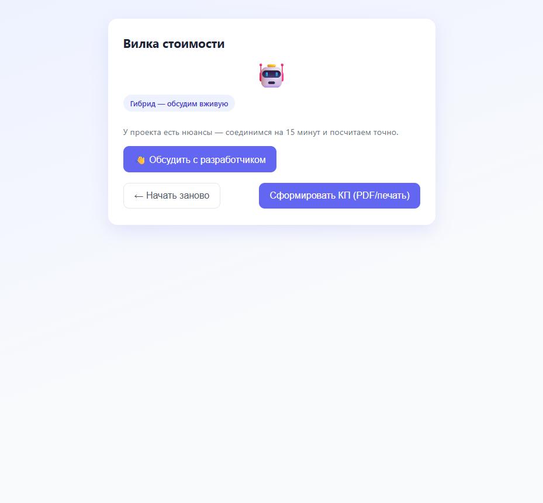
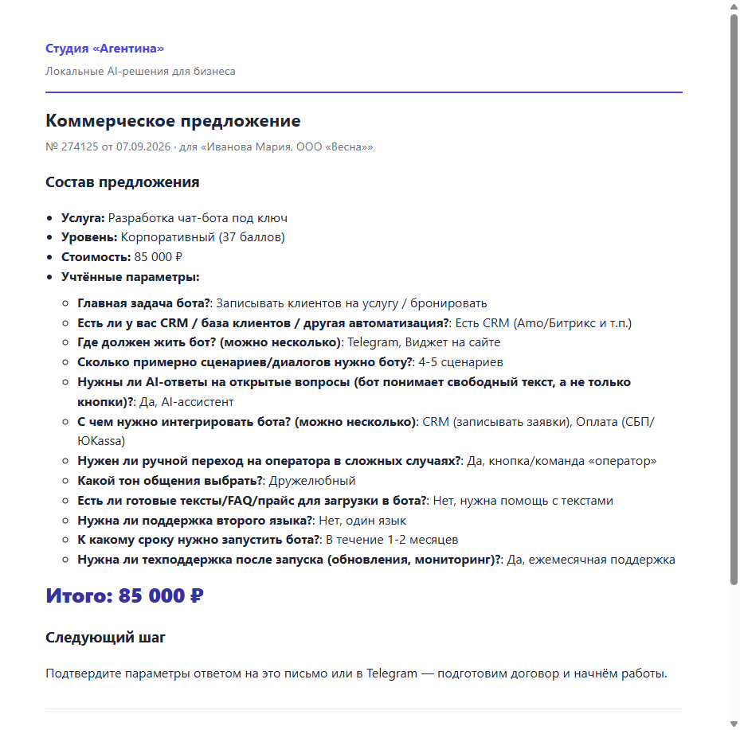

# Калькулятор коммерческих предложений (КП)

Веб-инструмент: короткая воронка из 7–9 вопросов «один вопрос на экран» → вилка стоимости бота → готовое КП в HTML/PDF. Сервер считает стоимость, фронтенд не дублирует формулу дважды — единый источник правды в `calculator.py`.

Реальная рабочая задача: этим калькулятором пользуется небольшая IT-студия при переговорах с клиентами (быстрая прикидка бюджета на чат-бота вместо ручного расчёта в электронных таблицах).

## Запуск

```bash
python src/app.py
# → http://127.0.0.1:8000
```

Сервер на стандартной библиотеке Python (`http.server`) — ничего устанавливать не нужно. Данные квиза (`data/quiz.json`), формула (`src/calculator.py`) и разметка (`src/static/`) отдаются отдельно, реквизиты для шапки КП — из `.env`.

## Что умеет

- 🧭 Воронка: 7–9 вопросов, один на экран, «Назад» на любом шаге
- 🔀 Ветвление по главному вопросу: **сценарный** бот (кнопки), **AI**-бот, **гибрид** (бот + живой менеджер), мягкий выход в созвон
- 💰 Вилка стоимости: расчёт по формуле → диапазон 0.9×–1.3×, а не точная цена
- 📄 Готовое КП: HTML-страница + печать в PDF, шапка с реквизитами из `.env`
- 🔋 Восстановление сессии через `localStorage` (перезагрузка страницы не теряет прогресс)
- 🧮 Два контура: «бот под ключ» (квиз) и «готовый продукт» (тарифная витрина с фиксированными ценами)
- 💬 Мягкие выходы и экран «договоримся по звонку» для сложных/неуверенных сценариев

## Структура

```
kp-calculator-v2/
├── .env.example           # реквизиты, подставляемые в шапку КП (заполни → переименуй в .env)
├── data/
│   └── quiz.json          # экраны, веса, правила ветвления, готовые продукты
├── src/
│   ├── calculator.py      # формула расчёта + единый источник правды
│   ├── app.py             # HTTP-сервер (статика + POST /api/estimate)
│   └── static/            # index.html, main.js, style.css (индиго-тема, адаптив)
├── tests/
│   └── test_calculator.py # 28 юнит-тестов
└── screenshots/           # скриншоты работающего проекта
```

## Формула

```
КП = (База × Платформа + Σ(интеграции) + Модуль_AI + Админка) × Срочность
```

| Параметр | Значение |
|----------|----------|
| База | сценарный 30 000 ₽ / AI 80 000 ₽ |
| Платформа | первая ×1.0, каждая доп. ×1.3, «везде один бот» ×1.8 |
| Интеграции | CRM +10 000 ₽, платёжка +15 000 ₽, таблицы +5 000 ₽ |
| AI | база знаний +20 000 ₽, дообучение(RAG) +40 000 ₽, «локально» ×2 |
| Админ-панель | +20 000 ₽ |
| Вилка | 0.9×–1.3× от расчёта |

Вилка вместо точной цены — осознанное продуктовое решение: вычисление оставляет торг и не фиксирует цену до уточнения деталей в разговоре.

## Структура вопроса «кто» — ветвление

| Ответ (brain) | Ветка | Следующие экраны |
|---|---|---|
| scripted | сценарный | capabilities → integrations → deadline |
| ai | AI | ai_base → ai_constraints → ai_fallback → deadline |
| hybrid / help_me | гибрид/созвон | экран «договоримся по звонку» → deadline |

Плюс стартовый выбор раздела: **бот под ключ** (квиз) или **готовый продукт** (фикс. тарифы).

## Тесты

```bash
pip install pytest
python -m pytest tests/test_calculator.py -v
```

28 тестов: ветвление, формула, вилка, мягкие выходы, созвон, скоринг лида, `evaluate`.

## Скриншоты

Страница результата (гибридный сценарий — без цены, предложение созвона):



Страница результата с готовой вилкой стоимости:



## Скилл проекта

В папке `skills/kp-calculator/` — скилл для агента: как сгенерировать новый калькулятор/изменить воронку, запустить и протестировать. См. [`skills/kp-calculator/SKILL.md`](skills/kp-calculator/SKILL.md).